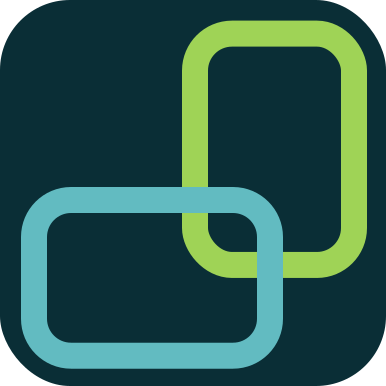

<p align="center">
  
</p>
<p align="center">API for ASD devotionals</p>

## Description

An API for retrieve ASD devotionals. \
The database is public for reading and the URL connection can be found in the app module. \
Feel free to use it.

## Installation

```bash
# Clone the repository
$ git clone https://github.com/jonathangomz/devotionals-api.git

# Install the dependencies
$ cd devotionals-api
$ npm install
```

## Running the app

```bash
# development
$ npm run start

# watch mode
$ npm run start:dev

# production mode
$ npm run start:prod
```

## Test

```bash
# unit tests
$ npm run test

# e2e tests
$ npm run test:e2e

# test coverage
$ npm run test:cov
```

## Documentation
Read the [Documentation][1] for more information of how to use the api.

[1]: https://documenter.getpostman.com/view/5868491/TVCjwkw2

## Stay in touch

- Author - [Jonathan Gomez](https://jonathangomz.codes)
- Twitter - [@jonathangomz](https://twitter.com/JonathanGomZ)
